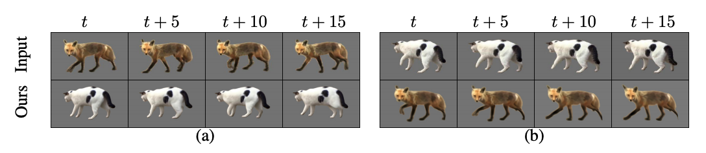
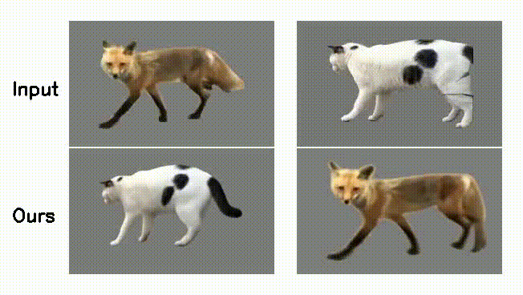
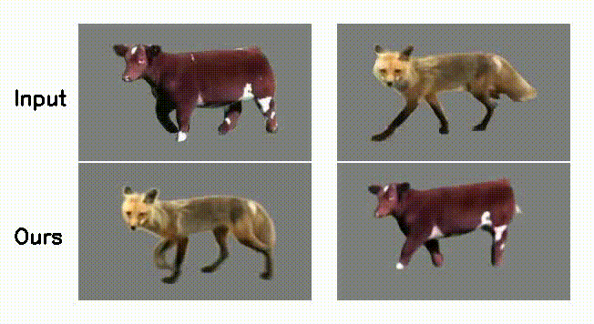
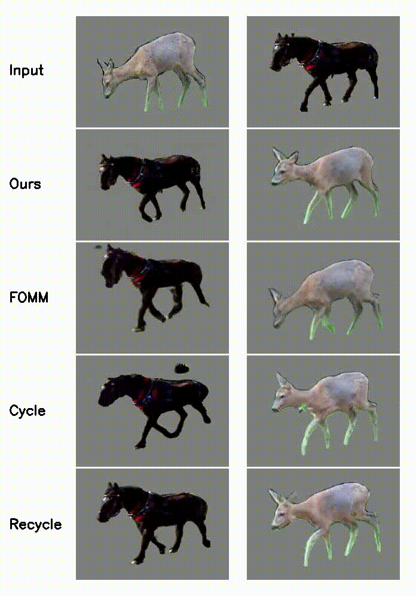
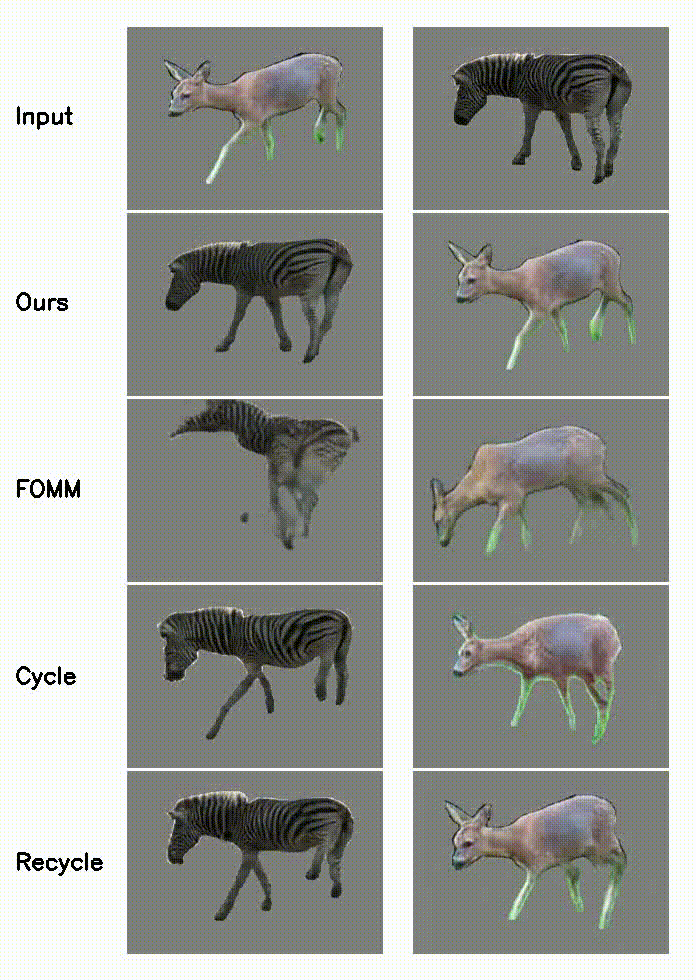
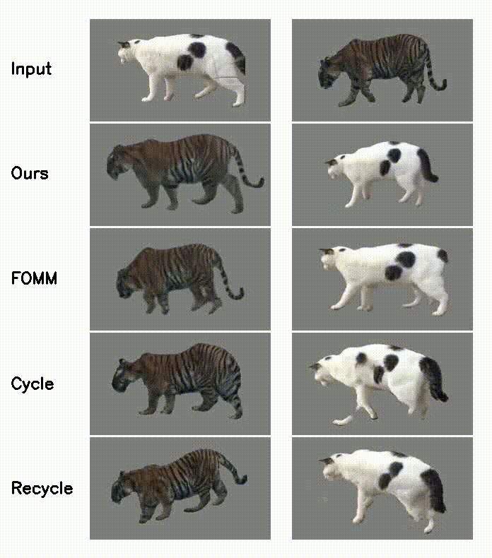
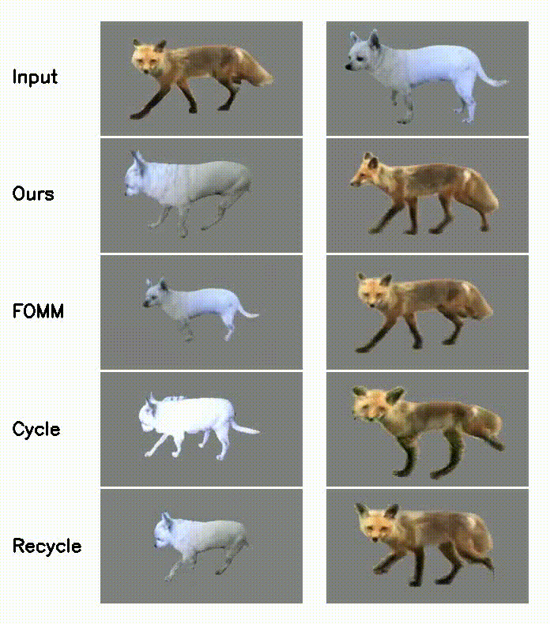
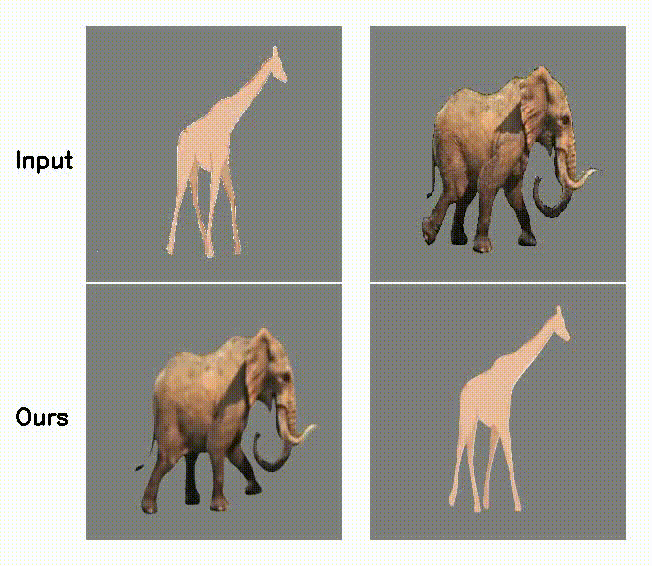
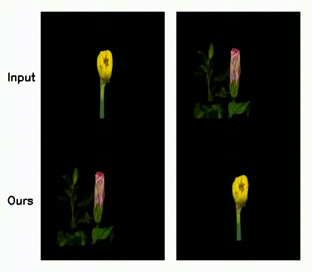
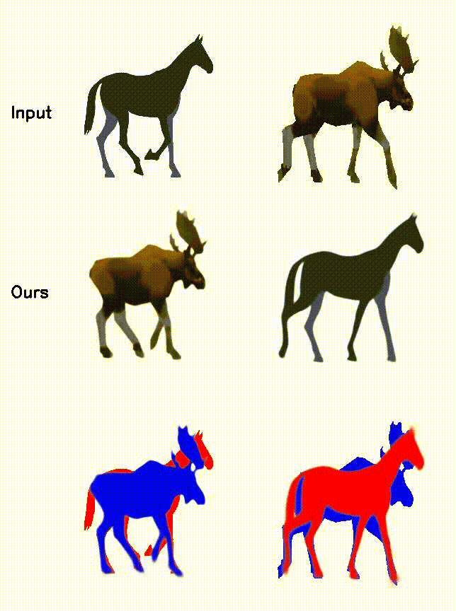

# JOKR: Joint Keypoint Representation for Unsupervised Cross-Domain Motion Retargeting

Pytorch implementation for the paper "JOKR: Joint Keypoint Representation for Unsupervised Cross-Domain Motion Retargeting".

## [Project Webpage](https://rmokady.github.io/JOKR/) | [Arxiv](https://arxiv.org/abs/2106.09679)

## Abstract: 
The task of unsupervised motion retargeting in videos has seen substantial advancements through the use of deep neural networks. While early works concentrated on specific object priors such as a human face or body, recent work considered the unsupervised case. When the source and target videos, however, are of different shapes, current methods fail. To alleviate this problem, we introduce JOKR - a JOint Keypoint Representation that captures the motion common to both the source and target videos, without requiring any object prior or data collection. By employing a domain confusion term, we enforce the unsupervised keypoint representations of both videos to be indistinguishable. This encourages disentanglement between the parts of the motion that are common to the two domains, and their distinctive appearance and motion, enabling the generation of videos that capture the motion of the one while depicting the style of the other. To enable cases where the objects are of different proportions or orientations, we apply a learned affine transformation between the JOKRs. This augments the representation to be affine invariant, and in practice broadens the variety of possible retargeting pairs. This geometry-driven representation enables further intuitive control, such as temporal coherence and manual editing. Through comprehensive experimentation, we demonstrate the applicability of our method to different challenging cross-domain video pairs. We evaluate our method both qualitatively and quantitatively, and demonstrate that our method handles various cross-domain scenarios, such as different animals, different flowers, and humans. We also demonstrate superior temporal coherency and visual quality compared to state-of-the-art alternatives, through statistical metrics and a user study.




<p float="left">
  
  
</p>


<p float="left">
  
  
</p>

<p float="left">
  
  
</p>

<p float="left">
  
  
</p>

<p float="left">
  
  
</p>


## Code:

### Prerequisites:

Python 3.6

```
pip install -r requirements.txt
```

### Train:
First step training:
```
CUDA_VISIBLE_DEVICES=0 python train_first_stage.py --root_a ./data/cat/train_seg/ --root_b ./data/fox/train_seg/ --resize --out ./first_cat_fox/ --bs 8 --num_kp 14 --lambda_disc 1.0 --delta 0.12 --lambda_l2 50.0 --lambda_pred 1.0 --lambda_sep 4.0 --lambda_sill 0.5 --affine
```

Second step training:
```
CUDA_VISIBLE_DEVICES=0 python train_second_stage.py --root_a data/cat/train_seg/ --root_b data/fox/train_seg/ --resize --no_hflip --out ./second_cat_fox/ --load ./first_cat_fox/checkpoint_45000 --bs 6 --num_kp 14 --lambda_vgg 1.0
```
If droplet artifact occur, please reduce the perceptual loss:
```
--lambda_vgg 0.5
```

Pytorch Dataloader might create too many threads - deacreasing CPU performance. This can be solved using:
```
MKL_NUM_THREADS=8
```
For pairs who share a similar scale/rotation/translation the affine-invariant can be omitted by simply avoid the 
```
--affine
```
Another example for (first stage) hyperparameters without the affine transformation is
```
--lambda_disc 0.5 --delta 0.12 --lambda_l2 50.0 --lambda_pred 1.0 --lambda_sep 1.0 --lambda_sill 0.5 --strong_kp --scale_kp 0.25
```

### Inference:

Generate the frames:
```
CUDA_VISIBLE_DEVICES=0 python inference.py --root_a ./data/cat/train_seg/ --root_b ./data/fox/train_seg/ --resize --no_hflip --out ./infer_cat_fox/ --load ./second_cat_fox/checkpoint_30000 --bs 1 --num_kp 14 --data_size 80 --affine --splitted
```

To video:
```
python gen_vid.py --img_path ./infer_cat_fox/ --prefix_b refined_ba_ --prefix_a b_ --out ./output/ --end_a 80 --same_length --resize --w 256 --h 157 --prefix_d refined_ab_ --prefix_c a_ --name infer_cat_fox_10.avi --fps 10.0
```


## Citation
If you found this work useful, please cite:

@article{mokady2021jokr,
  title={JOKR: Joint Keypoint Representation for Unsupervised Cross-Domain Motion Retargeting},
  author={Mokady, Ron and Tzaban, Rotem and Benaim, Sagie and Bermano, Amit H and Cohen-Or, Daniel},
  journal={arXiv preprint arXiv:2106.09679},
  year={2021}
}


## Contact
For further questions, ron.mokady@gmail.com .


## Acknowledgements
This implementation is heavily based on https://github.com/AliaksandrSiarohin/first-order-model and https://github.com/junyanz/pytorch-CycleGAN-and-pix2pix .
Examples were borrowed from [YouTube-Vos](https://youtube-vos.org/) train set.


